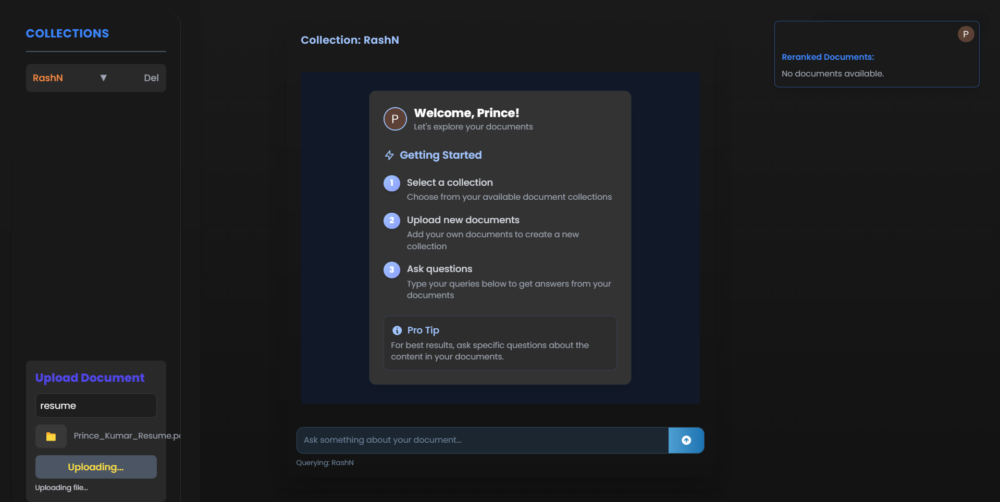

# 🚀 COOKGPT — Multimodal RAG Chatbot  
### 🥇 Winner – 1st Place, IIIT Naya Raipur Hackathon Hack-o-Harbour 2025

COOKGPT is a **multimodal Retrieval-Augmented Generation (RAG) chatbot** built to ingest, index, and query information from **diverse data sources**—including documents, structured files, audio, and web links—while maintaining **retrieval transparency, explainability, and reliability**.

Developed as a solution to **Problem Statement 2 (AIML Track)** at the **IIIT Naya Raipur Hackathon**, COOKGPT successfully implemented **almost every deliverable** outlined in the challenge and secured **1st place**.

---

## 🧠 Problem Statement Overview

The goal was to build a chatbot capable of:

- Processing **heterogeneous data formats**:
  - PDFs (with images, links, nested links)
  - CSV files
  - Voice/audio files
  - Web URLs
- Converting extracted content into a **vector database**
- Supporting **automatic updates** when documents are modified
- Implementing **Retrieval-Augmented Generation (RAG)**
- Providing **transparent retrieval, re-ranking, and LLM responses**
- Allowing **multiple document collections**
- Exposing **APIs for programmatic access**
- Enforcing **guardrails** to reduce hallucinations and unsafe outputs

COOKGPT was designed to directly map these requirements into a **robust, end-to-end system**.

---

## ✨ Key Features

- 🔎 **Multimodal Data Ingestion**
  - PDFs (text, images, hyperlinks, nested links)
  - CSVs and structured data
  - Audio/voice inputs
  - Web pages and documentation

- 🧩 **End-to-End RAG Pipeline**
  - Vector-based retrieval
  - Context re-ranking
  - LLM-powered answer synthesis

- 🔄 **Automatic Vector DB Updates**
  - Detects document changes and refreshes embeddings automatically

- 🔍 **Retrieval Transparency & Explainability**
  - Displays retrieved chunks
  - Shows re-ranking results
  - Separates retrieved context from final LLM output

- 🗂️ **Multi-Collection Support**
  - Create, manage, and query independent document collections

- 🌐 **API Access**
  - Programmatic RAG-based querying for external applications

- 🛡️ **Guardrails & Safety**
  - Reduces hallucinations and ungrounded responses
  - Ensures secure document handling

---

## 🖼️ Application Showcase

<div align="center">
  <div style="display: flex; justify-content: space-around; gap: 4; ">
    
    
    
    
     </div>
  <div align="center">
  <p><i>Cook GPT mobile application interfaces</i></p>
  </div>
</div>

---

## 🧱 System Architecture

```text
┌──────────────┐
│   User Query │
└──────┬───────┘
       ↓
┌─────────────────────┐
│ Vector Retriever    │  ← Pinecone
└──────┬──────────────┘
       ↓
┌─────────────────────┐
│ Re-ranking Layer    │  ← Context Scoring
└──────┬──────────────┘
       ↓
┌─────────────────────┐
│ LLM Response Engine │  ← Gemini API
└──────┬──────────────┘
       ↓
┌────────────────────────────────────┐
│ Transparent Output                 │
│ Final LLM Response                 │
└────────────────────────────────────┘
```
---

## 🛠️ Tech Stack

- **Programming Language:** Python  
- **Large Language Models:** Gemini
- **Retrieval-Augmented Generation:** LangChain
- **Vector Databases:** Pinecone  
- **Backend:** Flask  
- **Frontend:** Web-based UI (React)  
- **APIs:** RESTful APIs  
- **Deployment & Tooling:** Git, GitHub  

## 👨‍💻 Team Members

<div align="center">
  <table>
    <tr>
      <td align="center">
        
        <b>Hetharth Sachdeva</b><br/>
        <i>Project Lead & Python Developer (AI/ML)</i><br/>
        <a href="https://github.com/HetharthSachdeva">GitHub</a> • 
        <a href="https://www.linkedin.com/in/hetharth-sachdeva/">LinkedIn</a>
      </td>
      <td align="center">
        
        <b>Prince Kumar</b><br/>
        <i>Full-Stack Developer</i><br/>
        <a href="https://github.com/prince04kumar">GitHub</a> • 
        <a href="https://www.linkedin.com/in/princenitrr/">LinkedIn</a>
      </td>
    </tr>
    <tr>
      <td align="center">
        
        <b>Vedant Dubey</b><br/>
        <i>Python Developer</i><br/>
        <a href="https://github.com/vedantDube">GitHub</a> • 
        <a href="https://www.linkedin.com/in/vedant-dubey-55a934287/">LinkedIn</a>
      </td>
      <td align="center">
        
        <b>Mayank Verma</b><br/>
        <i>Frontend Developer</i><br/>
        <a href="https://github.com/vsmay-01">GitHub</a> • 
        <a href="https://www.linkedin.com/in/mayank-verma-723b62297/">LinkedIn</a>
      </td>
    </tr>
  </table>
</div>

---
## 📞 Contact & Support

- **Email**: hetharthsach@gmail.com(Team Leader)
- **Twitter**: [@CookGPT]()
- **Support**: [+919818248015]

---

<div align="center">
  
  <h3>Cook GPT</h3>
  <p>Made with ❤️ by Team UnknownCookError</p>
</div>

